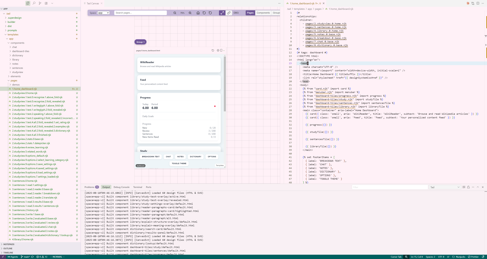
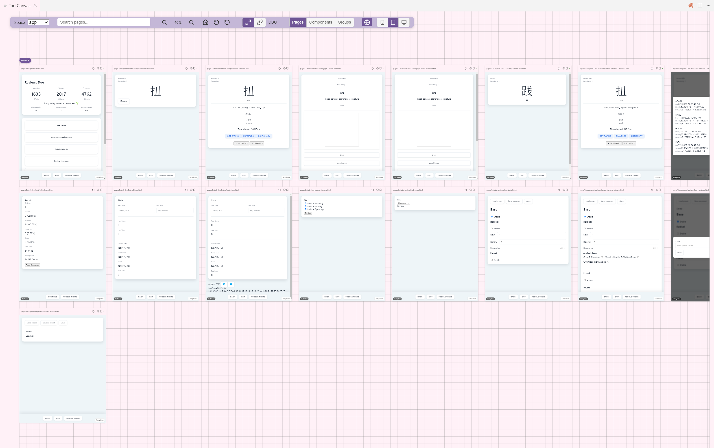

## Tad - Template-assisted design for developers





Tad implements a comprehensive design process that is friendly to engineers and agents alike, from the comfort of your IDE. It combines a Nunjucks template engine with built-in navigation, auto-complete and validation, with a powerful in-IDE Canvas to visualise your entire application design system, from token to collections. Bring your own coding agent and build a low-fidelity mock system in pure code. No mouse required.

---

### Highlights



- **Canvas (Webview)**
  - View your entire application and component library in an IDE pane 
  - Switch between responsive breakpoints with a single click
  - Jump directly to a page or component by name
  - View design structure in page sequence, component group, or by customisable tags
  - Navigate directly to page and component templates from the renderered design
  - Supports multiple template spaces for design reference, rapid prototyping, and ideation

- **Nunjucks Language Support**
  - Go to definition for `include`, `import`, `from`, `extends`
  - Document symbols (blocks/macros), intelligent path completion
  - Hover and diagnostics for unresolved references and page relationship annotations
  - Relationship links for `{# relationships: ... #}` or `{# @rel ... #}` blocks
  - Group pages and components with tags for visual grouping

- **Builder Integration**
  - Builds page and component HTML from the Nunjucks template specifications
  - Packaged builder (Nunjucks → HTML) with component state configurations
  - Emits `manifest.json` (output → sources, dependencies, relationships, tags)
  - Emits `canvas-metadata.json` (tags). See [build.md](mdc:build.md) and [template-engine.md](mdc:template-engine.md)

---

### Quick start

1) Create a first template space from the context menu (tad: Initialise space)

2) Begin developing your template system. Follow the samples in the template space for guidelines.

3) Build templates
   - “Tad: Sync Builder” to seed `.tad/builder/`
   - “Tad: Compile Templates” to compile pages/components
   - Create a space with “tad: Create Template Space”, or use defaults

4) Open the Canvas to view
   - Run “Tad: Open Canvas View” to review designs/outputs
   - If using the builder, compiled pages/components appear under `.tad/dist/`

For multi-space or deeper builder details, see [build.md](mdc:build.md) and [template-engine.md](mdc:template-engine.md).

---

### Templating basics

Tad uses Nunjucks templates organized into `pages/`, `components/`, `elements/`, and `styles/`. See the minimal sample space under `src/assets/sample-templates/`:

- `pages/` — Page templates rendered to final HTML outputs. Example: [1.home.njk](mdc:src/assets/sample-templates/pages/1.home.njk), [2.about.njk](mdc:src/assets/sample-templates/pages/2.about.njk)
- `components/` — Macro-based components rendered to preview pages with states. Example: [hello-card.njk](mdc:src/assets/sample-templates/components/hello-card.njk)
- `elements/` — Lower-level partials used by pages/components. Examples: [container.njk](mdc:src/assets/sample-templates/elements/container.njk), [footer.njk](mdc:src/assets/sample-templates/elements/footer.njk)
- `styles/` — Optional shared stylesheet copied into the build output. Example: [design-system.css](mdc:src/assets/sample-templates/styles/design-system.css)

Minimal component macro (from `components/hello-card.njk`):

```nunjucks

<section class="card hello-card" aria-label="Hello card">
  <h2 class="hello-title">{{ props.title or 'Hello' }}</h2>
  
    <p class="hello-text">{{ props.message }}</p>
  
  
    <a class="btn" href="{{ props.ctaHref }}">{{ props.ctaLabel }}</a>
  
</section>

```

Using elements and the component in a page (from `pages/1.home.njk`):

```nunjucks
{#
relationships:
  next:
    - pages/2.about.njk
#}





<!DOCTYPE html>
<html lang="en">
  <head>
    <meta charset="UTF-8" />
    <meta name="viewport" content="width=device-width, initial-scale=1" />
    <title>Sample · Home {{ titleSuffix }}</title>
    <link rel="stylesheet" href="{{ designSystemCssHref }}" />
  </head>
  <body>
    <div class="page">
      {{ container({
        body: [
          '<h1 class="page-title">Sample Home</h1>',
          helloCard({
            title: 'Welcome',
            message: 'This is a minimal sample page using a basic component.',
            ctaHref: '2.about.html',
            ctaLabel: 'Go to About'
          })
        ] | join('')
      }) }}

      {{ footer({ text: 'Sample Space · Home' }) }}
    </div>
  </body>
</html>
```

Notes:
- Import macros from `components/` and `elements/` with `` and pass a `props` object for component macros.
- Add page relationships at the very top inside a Nunjucks comment block. You can also use the compact form `{# @rel next: pages/2.about.njk #}`. See the section below for details.
- The builder injects `designSystemCssHref` so pages can link the shared stylesheet.

Build and preview:
- Run “Tad: Sync Builder” once to seed `.tad/builder/`
- Run “Tad: Compile Templates” to produce `.tad/dist/pages/**.html` and component previews under `.tad/dist/components/**`
- Open the Canvas via “Tad: Open Canvas View” to browse outputs, relationships, and tags

### Commands

- tad: Open Canvas View (`tad.openCanvas`)
- tad: Open Settings (`tad.openSettings`)
- tad: Create Template Space (`tad.createTemplateSpace`)
- tad: Compile Templates (`tad.buildTemplates`)
- tad: Sync Builder (`tad.syncBuilder`)

---

### Settings

- `tad.nunjucks.templateRoots`: default `[".tad/templates", "."]`
- `tad.nunjucks.defaultExtensions`: default `[".njk", ".nunjucks", ".html"]`
- `tad.nunjucks.ignore`: default ignores `node_modules` and `.tad/dist`

---

### Template relationships and tags (optional)

- Add page relationships at the very top of a Nunjucks page template:
  - YAML-in-comment:
    ```nunjucks
    {#
    relationships:
      next: [pages/2.studyview.0.home]
      related: [pages/3.library.overview]
    #}
    ```
  - Shorthand:
    ```nunjucks
    {# @rel next: pages/2.studyview.0.home #}
    ```
- Add tags via frontmatter or inline comment. These appear on the Canvas.

See extraction, resolution, and schema details in [template-engine.md](mdc:template-engine.md).

---

### Requirements

- VS Code ≥ 1.90
- Node.js 20+ (for local build/dev and the packaged builder)

---

### Contributing & License

Contributions are welcome. See [build.md](mdc:build.md) for local development and testing. Licensed under MIT.

