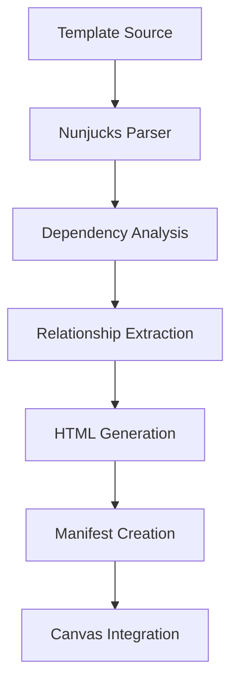

# TAD Architecture Deep Dive

## System Architecture Overview

TAD (Template-Assisted Design) is a VS Code extension that implements a sophisticated multi-layered architecture designed for template-based design system development. This document provides an in-depth analysis of the system's architectural patterns, data flows, and technical implementation details.

## Core Architectural Patterns

### 1. Extension-Host Pattern

#### VS Code Extension Lifecycle
```typescript
// src/extension.ts - Main Entry Point
export function activate(context: vscode.ExtensionContext) {
  // 1. Initialize core services
  const logger = Logger.initialize();
  const customAgent = new CustomAgentService(logger);

  // 2. Activate language features
  activateNunjucks(context);

  // 3. Register webview providers
  const sidebarProvider = new ChatSidebarProvider(context.extensionUri, customAgent, logger);
  vscode.window.registerWebviewViewProvider(ChatSidebarProvider.VIEW_TYPE, sidebarProvider);

  // 4. Register commands and panels
  registerCommands(context, sidebarProvider);
}
```

#### Service Layer Architecture
- **Logger Service**: Centralized logging with configurable levels and output channels
- **Custom Agent Service**: AI provider abstraction with tool orchestration
- **Chat Message Service**: Streaming communication management
- **Template Index Service**: File system indexing and watching

### 2. Webview Architecture

#### Dual Webview System
TAD implements two distinct webview contexts:

**Chat Sidebar Webview:**
- Lightweight React application for AI interaction
- Persistent state management with localStorage
- Streaming message handling with real-time updates
- Tool call visualization and progress tracking

**Canvas Panel Webview:**
- Full-featured React application for visual design
- Complex state management with multiple layout modes
- High-performance rendering with virtualization
- Interactive drag-and-drop functionality

#### Message Passing Protocol
```typescript
// Extension → Webview
interface WebviewMessage {
  command: string;
  data?: any;
  timestamp?: number;
}

// Webview → Extension
interface ExtensionMessage {
  command: string;
  data?: any;
  chatHistory?: CoreMessage[];
}
```

### 3. Language Server Implementation

#### LSP Provider Architecture
```typescript
// src/nunjucks/index.ts
export function activateNunjucks(context: vscode.ExtensionContext) {
  const config = readConfig();
  const index = new TemplateIndex();
  const resolver = new TemplateResolver(config);
  const diagnostics = new NunjucksDiagnostics(resolver);

  // Register LSP providers
  context.subscriptions.push(
    vscode.languages.registerDefinitionProvider(selector, new NunjucksDefinitionProvider(resolver)),
    vscode.languages.registerCompletionItemProvider(selector, new NunjucksCompletionProvider(index)),
    vscode.languages.registerHoverProvider(selector, new NunjucksHoverProvider(resolver)),
    vscode.languages.registerDocumentSymbolProvider(selector, new NunjucksDocumentSymbolProvider()),
    vscode.languages.registerDocumentLinkProvider(selector, new NunjucksRelationshipLinkProvider(resolver)),
    diagnostics
  );
}
```

#### Template Resolution Pipeline
1. **Path Tokenization**: Parse include/import/extends statements
2. **Extension Inference**: Add default extensions if missing
3. **Context Resolution**: Determine current space and template roots
4. **Search Strategy**: Progressive fallback through resolution strategies
5. **Validation**: Check file existence and accessibility

## Data Flow Architecture

### 1. Template Build Pipeline

#### Build Process Flow


#### Multi-Space Build Architecture
- **Space Configuration**: JSON-defined build contexts
- **Parallel Processing**: Independent build pipelines per space
- **Dependency Management**: Isolated package management
- **Output Aggregation**: Unified manifest generation

### 2. AI Agent Architecture

#### Tool-Based Agent Design
```typescript
// src/services/customAgentService.ts
class CustomAgentService {
  private tools: Tool[] = [
    new ReadTool(),
    new WriteTool(),
    new EditTool(),
    new GlobTool(),
    new GrepTool(),
    new LsTool(),
    new BashTool(),
    new ThemeTool()
  ];

  async query(messages: CoreMessage[], onMessage: (message: any) => void): Promise<void> {
    // Tool orchestration logic
  }
}
```

#### Streaming Response Architecture
- **Progressive Text Generation**: Chunked response handling
- **Tool Call Execution**: Asynchronous tool invocation
- **Result Streaming**: Real-time result delivery
- **Error Recovery**: Graceful failure handling

### 3. Canvas Rendering Architecture

#### Component Hierarchy
```
CanvasView
├── Toolbar (search, layout controls, viewport modes)
├── TransformWrapper (zoom/pan container)
├── CanvasContent
│   ├── ConnectionLines (SVG overlay)
│   ├── DesignFrame[] (individual frames)
│   └── TeleportFrame[] (relationship placeholders)
└── Loading/Error States
```

#### State Management Architecture
```typescript
interface CanvasState {
  // Data layer
  designFiles: DesignFile[];
  selectedFrames: string[];

  // Layout layer
  layoutMode: 'grid' | 'relationships';
  currentConfig: CanvasConfig;

  // Interaction layer
  transform: { scale: number; x: number; y: number };
  dragState: DragState | null;

  // Viewport layer
  globalViewportMode: ViewportMode;
  frameViewports: Record<string, ViewportMode>;
}
```

## Performance Architecture

### 1. Rendering Optimizations

#### Viewport Culling System
```typescript
// src/webview/components/CanvasView.tsx
const visibleBounds = {
  left: -buffer,
  right: containerWidth + buffer,
  top: -buffer,
  bottom: containerHeight + buffer
};

const isVisible = (frame: DesignFile) =>
  frame.x + frame.width >= visibleBounds.left &&
  frame.x <= visibleBounds.right &&
  frame.y + frame.height >= visibleBounds.top &&
  frame.y <= visibleBounds.bottom;
```

#### Level-of-Detail Rendering
```typescript
const getOptimalRenderMode = (zoom: number): 'placeholder' | 'iframe' => {
  return zoom < LOD_THRESHOLD ? 'placeholder' : 'iframe';
};
```

### 2. State Update Optimizations

#### RAF Throttling
```typescript
const throttledUpdate = useCallback(() => {
  if (rafRef.current === null) {
    rafRef.current = requestAnimationFrame(() => {
      // Perform state update
      rafRef.current = null;
    });
  }
}, []);
```

#### Memoization Strategy
```typescript
const memoizedConnections = useMemo(() =>
  calculateConnections(designFiles, relationships),
  [designFiles, relationships]
);
```

### 3. Memory Management

#### Component Lifecycle Optimization
- **Lazy Loading**: Components loaded on demand
- **Cleanup**: Proper disposal of event listeners and timers
- **Reference Management**: Weak references for large objects
- **Cache Invalidation**: Intelligent cache clearing strategies

## Security Architecture

### 1. Webview Security Model

#### Content Security Policy
```typescript
// Canvas webview CSP
const csp = [
  "default-src 'none'",
  "script-src 'nonce-${nonce}'",
  "style-src 'unsafe-inline'",
  "img-src data: https:",
  "connect-src 'none'"
].join('; ');
```

#### Message Validation
```typescript
const validateMessage = (message: any): boolean => {
  return (
    typeof message.command === 'string' &&
    VALID_COMMANDS.includes(message.command) &&
    (!message.data || typeof message.data === 'object')
  );
};
```

### 2. Tool Security Boundaries

#### Path Validation
```typescript
const validatePath = (path: string): boolean => {
  const resolved = path.resolve(path);
  const workspaceRoot = vscode.workspace.workspaceFolders?.[0]?.uri.fsPath;

  return resolved.startsWith(workspaceRoot) &&
         !resolved.includes('..') &&
         !isHiddenFile(resolved);
};
```

#### Command Filtering
```typescript
const UNSAFE_COMMANDS = ['rm', 'del', 'format', 'fdisk'];

const isSafeCommand = (command: string): boolean => {
  return !UNSAFE_COMMANDS.some(unsafe =>
    command.toLowerCase().includes(unsafe)
  );
};
```

## Extensibility Architecture

### 1. Plugin System

#### Tool Registration Interface
```typescript
interface Tool {
  name: string;
  description: string;
  parameters: ToolParameter[];
  execute(args: any, context: ToolContext): Promise<ToolResult>;
}

class ToolRegistry {
  register(tool: Tool): void;
  get(name: string): Tool | undefined;
  list(): Tool[];
}
```

#### Provider Abstraction
```typescript
interface AIProvider {
  name: string;
  models: string[];
  createClient(apiKey: string): AIClient;
}

interface AIClient {
  generateText(prompt: string, options?: GenerateOptions): Promise<StreamingTextResponse>;
}
```

### 2. Layout Strategy Pattern

#### Layout Strategy Interface
```typescript
interface LayoutStrategy {
  name: string;
  calculatePositions(
    frames: DesignFile[],
    config: CanvasConfig,
    customPositions: Record<string, GridPosition>
  ): LayoutResult;
}

class GridLayoutStrategy implements LayoutStrategy {
  calculatePositions(frames, config, customPositions): LayoutResult {
    // Grid positioning logic
  }
}
```

### 3. Build Extension Points

#### Build Pipeline Hooks
```typescript
interface BuildHook {
  name: string;
  phase: 'pre-build' | 'post-build' | 'pre-render' | 'post-render';
  execute(context: BuildContext): Promise<void>;
}

class BuildPipeline {
  private hooks: BuildHook[] = [];

  addHook(hook: BuildHook): void {
    this.hooks.push(hook);
  }

  async executePhase(phase: string, context: BuildContext): Promise<void> {
    const phaseHooks = this.hooks.filter(h => h.phase === phase);
    await Promise.all(phaseHooks.map(hook => hook.execute(context)));
  }
}
```

## Configuration Architecture

### 1. Hierarchical Configuration

#### VS Code Settings Integration
```json
{
  "tad.nunjucks": {
    "templateRoots": ["${workspaceFolder}/.tad/templates", "${workspaceFolder}"],
    "defaultExtensions": [".njk", ".nunjucks", ".html"],
    "ignore": ["**/node_modules/**", ".tad/dist/**"]
  },
  "tad.ai": {
    "modelProvider": "openai",
    "model": "gpt-4o",
    "openaiApiKey": "",
    "anthropicApiKey": ""
  }
}
```

#### Workspace Configuration
```json
// .tad/spaces.json
{
  "defaultSpace": "main",
  "spaces": [
    {
      "name": "main",
      "templateRoot": ".tad/templates",
      "distDir": ".tad/dist"
    }
  ]
}
```

### 2. Runtime Configuration Management

#### Configuration Service
```typescript
class ConfigurationService {
  private config: Map<string, any> = new Map();

  watchConfiguration(): void {
    vscode.workspace.onDidChangeConfiguration(event => {
      if (event.affectsConfiguration('tad')) {
        this.reloadConfiguration();
        this.notifySubscribers();
      }
    });
  }

  get<T>(key: string): T | undefined {
    return this.config.get(key);
  }
}
```

## Error Handling and Resilience

### 1. Error Boundary Architecture

#### Extension Error Handling
```typescript
class ErrorHandler {
  static handle(error: Error, context: string): void {
    Logger.error(`[${context}] ${error.message}`, error);

    // Report to user if appropriate
    if (this.isUserVisibleError(error)) {
      vscode.window.showErrorMessage(`TAD: ${error.message}`);
    }

    // Attempt recovery
    this.attemptRecovery(error, context);
  }
}
```

#### Webview Error Boundaries
```tsx
class ErrorBoundary extends React.Component {
  componentDidCatch(error: Error, errorInfo: React.ErrorInfo) {
    // Log error details
    console.error('Canvas Error:', error, errorInfo);

    // Send to extension for logging
    vscode.postMessage({
      command: 'error',
      data: { error: error.message, stack: error.stack }
    });

    // Render fallback UI
    this.setState({ hasError: true });
  }
}
```

### 2. Graceful Degradation

#### Feature Detection
```typescript
const checkFeatureSupport = (): FeatureSupport => {
  return {
    webgl: checkWebGLSupport(),
    webworkers: checkWebWorkerSupport(),
    indexeddb: checkIndexedDBSupport(),
    fileApi: checkFileAPISupport()
  };
};
```

#### Fallback Strategies
```typescript
const getFallbackStrategy = (failedFeature: string): FallbackStrategy => {
  switch (failedFeature) {
    case 'webgl':
      return { renderer: 'canvas2d', performance: 'reduced' };
    case 'webworkers':
      return { processing: 'main-thread', concurrency: 'limited' };
    default:
      return { mode: 'basic', features: 'minimal' };
  }
};
```

## Testing Architecture

### 1. Test Pyramid Implementation

#### Unit Testing
```typescript
// Template resolver tests
describe('TemplateResolver', () => {
  test('resolves relative paths correctly', () => {
    const resolver = new TemplateResolver(config);
    const result = resolver.resolve('components/button', '/pages/home.njk');
    expect(result).toBe('/workspace/components/button.njk');
  });
});
```

#### Integration Testing
```typescript
// Build pipeline integration tests
describe('BuildPipeline', () => {
  test('compiles templates with dependencies', async () => {
    const pipeline = new BuildPipeline();
    const result = await pipeline.build(testSpace);

    expect(result.manifest).toBeDefined();
    expect(result.errors).toHaveLength(0);
  });
});
```

#### End-to-End Testing
```typescript
// Full extension workflow tests
describe('ExtensionWorkflow', () => {
  test('complete template authoring workflow', async () => {
    // 1. Create template space
    // 2. Author templates
    // 3. Build templates
    // 4. Open canvas
    // 5. Verify rendering
  });
});
```

### 2. Performance Testing

#### Benchmarking Framework
```typescript
class PerformanceBenchmark {
  async measure(operation: () => Promise<void>): Promise<PerformanceResult> {
    const start = performance.now();
    await operation();
    const end = performance.now();

    return {
      duration: end - start,
      memoryUsage: process.memoryUsage(),
      cpuUsage: process.cpuUsage()
    };
  }
}
```

## Deployment and Distribution

### 1. Build Pipeline

#### Extension Packaging
```bash
# Build process
npm run compile          # TypeScript compilation
npm run package          # Extension packaging
npm run publish          # VS Code Marketplace upload
```

#### Asset Management
- **Bundled Assets**: Builder scripts and sample templates
- **External Dependencies**: AI SDKs and utility libraries
- **Resource Optimization**: Minification and tree shaking
- **Cross-Platform Compatibility**: Windows, macOS, Linux support

### 2. Update Mechanism

#### Version Management
```json
// package.json
{
  "version": "0.0.8",
  "engines": {
    "vscode": "^1.90.0",
    "node": ">=20.0.0"
  },
  "categories": ["Other"],
  "keywords": ["nunjucks", "templates", "design-system", "canvas"]
}
```

#### Migration Strategy
```typescript
class MigrationManager {
  async migrate(fromVersion: string, toVersion: string): Promise<void> {
    const migrations = this.getMigrations(fromVersion, toVersion);

    for (const migration of migrations) {
      await migration.up();
    }
  }
}
```

## Conclusion

TAD's architecture demonstrates a sophisticated approach to building complex VS Code extensions. The system's layered design, with clear separation of concerns between extension host, webviews, language server, and build system, provides a robust foundation for template-based design workflows.

Key architectural strengths include:
- **Modular Design**: Clear boundaries between system components
- **Performance Focus**: Advanced rendering and state management optimizations
- **Security First**: Comprehensive security measures and validation
- **Extensibility**: Plugin architecture for future enhancements
- **Resilience**: Comprehensive error handling and graceful degradation

This architecture enables TAD to provide a seamless, high-performance experience for developers working with complex template systems while maintaining the flexibility to evolve with changing requirements.