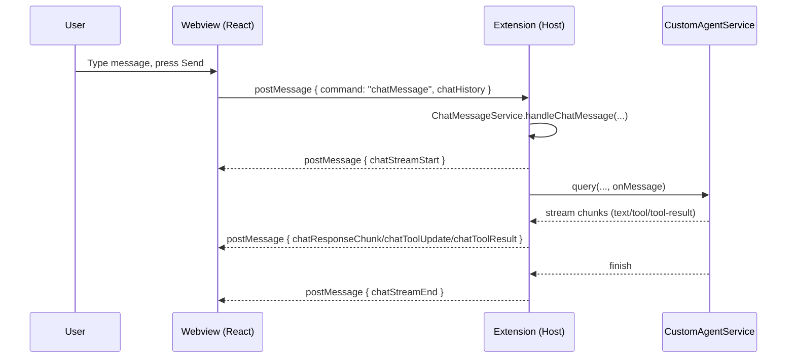
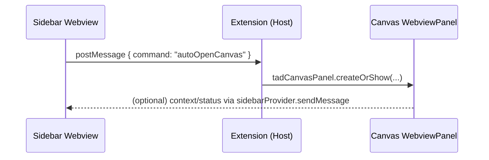

## Application lifecycle overview

This document describes how the extension initializes, how it interacts with the VS Code host, and how input events flow between the webviews and the extension.

- **Core entrypoint**: `src/extension.ts` (`activate` function)
- **Sidebar chat webview**: `src/providers/chatSidebarProvider.ts` (+ `src/templates/webviewTemplate.ts`)
- **Canvas panel webview**: `tadCanvasPanel` in `src/extension.ts`
- **Webview React app**: `src/webview/index.tsx`, `src/webview/App.tsx`
- **Agent + chat streaming**: `src/services/customAgentService.ts`, `src/services/chatMessageService.ts`
- **Nunjucks language features**: `src/nunjucks/*`


## Boot and initialization

### Extension activation (host side)
When the extension is activated, VS Code calls `activate(context)` in `src/extension.ts`. High-level steps:

1. Initialize logging and the agent service
   - `Logger.initialize()` and `Logger.info(...)`
   - Construct `CustomAgentService` for AI/Tooling
2. Activate Nunjucks language features
   - `activateNunjucks(context)` registers definition, symbols, completion, hover, links, diagnostics
3. Register commands and views
   - Commands like `tad.showChatSidebar`, `tad.openCanvas`, `tad.clearChat`, `tad.initializeProject`, API key configurators, etc.
   - Register `ChatSidebarProvider` via `vscode.window.registerWebviewViewProvider(...)`
4. Wire sidebar <-> canvas coordination
   - Attach a message handler to `ChatSidebarProvider` for canvas-related commands (auto-open canvas, status checks, context passing)

Key reference:

```startLine:1298:endLine:1356:src/extension.ts
export function activate(context: vscode.ExtensionContext) {
  Logger.initialize();
  const customAgent = new CustomAgentService(Logger.getOutputChannel());
  activateNunjucks(context);
  const sidebarProvider = new ChatSidebarProvider(context.extensionUri, customAgent, Logger.getOutputChannel());
  const sidebarDisposable = vscode.window.registerWebviewViewProvider(
    ChatSidebarProvider.VIEW_TYPE,
    sidebarProvider,
    { webviewOptions: { retainContextWhenHidden: true } }
  );
  // ...commands registration...
}
```

### Nunjucks language features
`activateNunjucks(context)` wires language providers and diagnostics, then watches documents and configuration changes:

```startLine:12:endLine:33:src/nunjucks/index.ts
export function activateNunjucks(context: vscode.ExtensionContext) {
  const config = readConfig();
  const index = new TemplateIndex();
  const resolver = new TemplateResolver(config);
  const diagnostics = new NunjucksDiagnostics(resolver);

  index.initialize(config).catch(() => {/* ignore */});

  context.subscriptions.push(
    vscode.languages.registerDefinitionProvider(nunjucksSelector, new NunjucksDefinitionProvider(resolver)),
    vscode.languages.registerDocumentSymbolProvider(nunjucksSelector, new NunjucksDocumentSymbolProvider()),
    vscode.languages.registerCompletionItemProvider(nunjucksSelector, new NunjucksCompletionProvider(index), '"', '\''),
    vscode.languages.registerHoverProvider(nunjucksSelector, new NunjucksHoverProvider(resolver)),
    vscode.languages.registerDocumentLinkProvider(nunjucksSelector, new NunjucksRelationshipLinkProvider(resolver)),
    diagnostics
  );

  context.subscriptions.push(
    vscode.workspace.onDidOpenTextDocument(doc => diagnostics.validateDocument(doc)),
    vscode.workspace.onDidChangeTextDocument(e => diagnostics.validateDocument(e.document))
  );
}
```

The `TemplateIndex` scans and watches template roots via a `FileSystemWatcher`:

```startLine:43:endLine:55:src/nunjucks/indexer.ts
private watch(config: NunjucksConfig) {
  const ws = vscode.workspace.workspaceFolders?.[0];
  if (!ws) return;
  const glob = `**/*.{${config.defaultExtensions.map(e => e.replace(/^\./, '')).join(',')}}`;
  const watcher = vscode.workspace.createFileSystemWatcher(new vscode.RelativePattern(ws, glob));
  this.watchers.push(watcher);
  watcher.onDidCreate(uri => { /* add to index */ });
  watcher.onDidDelete(uri => { /* remove from index */ });
}
```


## Webview creation and React bootstrapping

### Sidebar chat view
`ChatSidebarProvider` resolves the view by:

- Enabling scripts and setting `localResourceRoots`
- Generating HTML via `generateWebviewHtml(...)`
- Handling messages from the webview (`onDidReceiveMessage`)

```startLine:31:endLine:57:src/providers/chatSidebarProvider.ts
public resolveWebviewView(webviewView: vscode.WebviewView, _ctx, _token) {
  this._view = webviewView;
  webviewView.webview.options = { enableScripts: true, localResourceRoots: [ /* dist, assets */ ] };
  const webviewContext = { layout: 'sidebar', extensionUri: this._extensionUri.toString() };
  webviewView.webview.html = generateWebviewHtml(webviewView.webview, this._extensionUri, webviewContext);
  webviewView.webview.onDidReceiveMessage(async (message) => { /* chat + model switching */ });
}
```

`generateWebviewHtml` sets a strict CSP, injects the bundled script, and exposes a typed context into `window.__WEBVIEW_CONTEXT__` for the React app:

```startLine:34:endLine:76:src/templates/webviewTemplate.ts
return `<!DOCTYPE html>...<script>window.__WEBVIEW_CONTEXT__ = ${JSON.stringify({ ...context, logoUris })};</script>
<script src="${scriptUri}"></script>`;
```

The React entry looks up the context and decides whether to render the full app or a compact sidebar:

```startLine:24:endLine:41:src/webview/index.tsx
const context: WebviewContext = (window as any).__WEBVIEW_CONTEXT__;
if (!context) { /* error */ }
else if (context.layout === 'panel') { root.render(<App />); }
else { const vscode = acquireVsCodeApi(); root.render(<ChatInterface layout="sidebar" vscode={vscode} />); }
```

### Canvas panel view
The canvas is a separate `WebviewPanel` managed by `tadCanvasPanel`:

```startLine:1929:endLine:1944:src/extension.ts
const panel = vscode.window.createWebviewPanel(
  tadCanvasPanel.viewType,
  'Tad Canvas',
  column || vscode.ViewColumn.One,
  { enableScripts: true, localResourceRoots: [ /* dist, assets */ ] }
);
tadCanvasPanel.currentPanel = new tadCanvasPanel(panel, extensionUri, sidebarProvider);
```

The panel hooks disposal, file watchers, and message handling (`onDidReceiveMessage`) to serve requests like opening files, loading design files, etc.


## Extension ↔ Webview interaction model

### Message bridge
- Webview → Extension: UI actions post messages via `vscode.postMessage({ command, ... })`.
- Extension → Webview: the extension responds via `webview.postMessage({ command, ... })`.

Chat flow is handled by `ChatMessageService`:

```startLine:14:endLine:31:src/services/chatMessageService.ts
async handleChatMessage(message: any, webview: vscode.Webview) {
  const chatHistory = message.chatHistory || [];
  // Start stream
  webview.postMessage({ command: 'chatStreamStart' });
  // Stream AI output via onMessage → webview.postMessage('chatResponseChunk' | 'chatToolUpdate' | 'chatToolResult')
  // End stream → webview.postMessage('chatStreamEnd')
}
```

On the webview side, `useChat` subscribes to `window` messages to update UI state as chunks arrive and to handle tool-call updates/results:

```startLine:140:endLine:169:src/webview/hooks/useChat.ts
useEffect(() => {
  const messageHandler = (event: MessageEvent) => {
    const message = event.data;
    switch (message.command) {
      case 'chatResponseChunk': /* append assistant/tool messages */ break;
      case 'chatToolUpdate':    /* update streaming tool args */ break;
      case 'chatToolResult':    /* mark tool as completed     */ break;
    }
  };
  window.addEventListener('message', messageHandler);
  return () => window.removeEventListener('message', messageHandler);
}, []);
```

### Practical code examples

- Webview sends a chat message (React):

```tsx
// inside a React component
const vscode = acquireVsCodeApi();
function onSend(message: string, chatHistory: any[]) {
  vscode.postMessage({
    command: 'chatMessage',
    message,
    chatHistory,
  });
}
```

- Extension receives and routes messages (sidebar provider):

```ts
webviewView.webview.onDidReceiveMessage(async (message) => {
  switch (message.command) {
    case 'chatMessage':
      await this.messageHandler.handleChatMessage(message, webviewView.webview);
      break;
    case 'stopChat':
      await this.messageHandler.stopCurrentChat(webviewView.webview);
      break;
  }
});
```

- Extension sends messages back to the webview (clear chat):

```ts
this._view?.webview.postMessage({ command: 'clearChat' });
```

- Register a command and open the canvas panel:

```ts
const openCanvasDisposable = vscode.commands.registerCommand('tad.openCanvas', () => {
  tadCanvasPanel.createOrShow(context.extensionUri, sidebarProvider);
});
context.subscriptions.push(openCanvasDisposable);
```

- Canvas webview handles inbound messages (open a file in editor):

```ts
this._panel.webview.onDidReceiveMessage((msg) => {
  if (msg.command === 'openTemplateFile' && typeof msg.data?.filePath === 'string') {
    const uri = vscode.Uri.file(msg.data.filePath);
    vscode.window.showTextDocument(uri, { preview: false });
  }
});
```

- Change AI provider/model from the webview UI and react to confirmation:

```tsx
// send request from webview
vscode.postMessage({ command: 'changeProvider', model: 'gpt-4o' });

// listen for confirmation in webview
window.addEventListener('message', (e) => {
  if (e.data?.command === 'providerChanged') {
    // update UI with e.data.provider / e.data.model
  }
});
```

- Stop a streaming chat from the webview:

```tsx
vscode.postMessage({ command: 'stopChat' });
```

- React to configuration changes that affect diagnostics (host side):

```ts
vscode.workspace.onDidChangeConfiguration((e) => {
  if (e.affectsConfiguration('tad.nunjucks')) {
    const cfg = readConfig();
    resolver.updateConfig(cfg);
    index.initialize(cfg);
    const editor = vscode.window.activeTextEditor;
    if (editor) diagnostics.validateDocument(editor.document);
  }
});
```

### Commands and configuration
- Commands registered in `activate` can be invoked by the user or programmatically from the webview via `vscode.commands.executeCommand(...)` (e.g., change provider, open settings, open canvas).
- Configuration is read/written via `vscode.workspace.getConfiguration('tad')`. Provider/model changes notify the webview (`providerChanged`).

### Filesystem and editor integration
- The Nunjucks indexer and diagnostics watch template files and revalidate on open/change events.
- The canvas panel can open files in the editor (`vscode.window.showTextDocument`) in response to webview requests.


## Input event mechanisms

Input enters the system through these channels:

- **Command palette / keybindings (host)**
  - Users trigger commands like `tad.showChatSidebar`, `tad.openCanvas`, `tad.clearChat`, `tad.initializeProject`.
  - The extension handles them in `activate` and delegates to services/panels/providers.

- **Webview UI events (frontend)**
  - React components (chat input, buttons, model selector, canvas controls) call `vscode.postMessage({ command, ... })`.
  - Notable commands handled by the extension:
    - Chat: `chatMessage`, `stopChat`, `executeAction`
    - Model: `getCurrentProvider`, `changeProvider`
    - Canvas: `checkCanvasStatus`, `autoOpenCanvas`, `setContextFromCanvas`
    - Assets: `saveImageToMoodboard`, `getBase64Image`, `getCssFileContent`
    - Templates: `listTemplates`, `readTemplate`, `openTemplateFile`, `loadDesignFiles`, `requestSpaces`
    - Misc: `initializetad`, `showError`, `submitEmail`

- **VS Code workspace/editor events (host)**
  - Text/document events: `onDidOpenTextDocument`, `onDidChangeTextDocument` → revalidate diagnostics.
  - Configuration changes: `onDidChangeConfiguration` → reinitialize Nunjucks resolver/index and revalidate.
  - Filesystem: `FileSystemWatcher` in the Nunjucks indexer and canvas panel.
  - Webview lifecycle: `onDidDispose` for panels; the extension cleans up resources.

- **Streaming control**
  - Webview can stop a running chat via `stopChat`, which triggers an `AbortController` in `ChatMessageService` and sends `chatStopped` back.


## Security and sandboxing

- Webviews run with a strict CSP and limited `localResourceRoots`.
- Only `enableScripts: true` resources from allowed roots are loaded.
- Context for the webview is injected as inert JSON into `window.__WEBVIEW_CONTEXT__`.
- API keys are managed in VS Code settings and validated before use; the webview receives only high-level status and prompts to configure.


## Shutdown and disposal

- Sidebar views are retained when hidden (`retainContextWhenHidden: true`), preserving state.
- Canvas panel cleans up on `onDidDispose`.
- File watchers and disposables are managed via `context.subscriptions` and class `dispose` methods.


## Sequence: sending a chat message




## Sequence: opening the canvas from sidebar




## Notes for contributors

- Keep host-side message switch statements exhaustive and centralized (`ChatSidebarProvider`, `tadCanvasPanel`, and the handler in `activate`).
- Prefer typed payloads for webview messages and keep command names stable.
- Add new commands to `package.json` contribution points and register in `activate`.
- Re-run/refresh diagnostics after any configuration affecting Nunjucks resolution.


